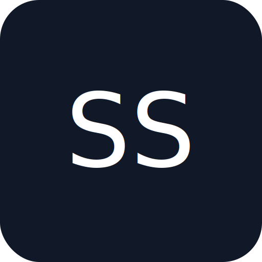

# Suvojeet Sengupta - Personal Portfolio

<p align="center">
  
</p>

<h3 align="center">Singer | Developer | Content Creator</h3>

<p align="center">
  <a href="https://suvojeetsengupta.in/"><strong>suvojeetsengupta.in</strong></a>
</p>

<p align="center">
  
  
  
  
  
</p>

---

## 🌟 About

This is the source code for the personal portfolio website of **Suvojeet Sengupta**. The website showcases his work as a Singer, Developer, and Content Creator. It's a modern, single-page application built with the MERN stack, featuring a dynamic blog, a music portfolio, and real-time user engagement.

## ✨ Features

*   **🎤 Live Visitor Count:** Real-time display of current website visitors.
*   **🎸 Emoji Reactions:** Interactive emoji reactions on blog posts and videos.
*   **🎼 Music Showcase:** A dedicated page for musical work with embedded YouTube videos.
*   **✍️ Dynamic Blog:** A blog section with articles fetched from Contentful CMS.
*   **📱 Responsive Design:** Fully responsive and works seamlessly across all devices.
*   **🚀 Automated Updates:** The music section is automatically updated with new videos from a YouTube channel via a GitHub Action.

## 🛠️ Tech Stack

### Frontend

*   **Framework:** [React](https://reactjs.org/)
*   **Routing:** [React Router](https://reactrouter.com/)
*   **Styling:** [Tailwind CSS](https://tailwindcss.com/)
*   **Animations:** [Framer Motion](https://www.framer.com/motion/)
*   **CMS:** [Contentful](https://www.contentful.com/)
*   **Real-time Communication:** [Socket.io Client](https://socket.io/docs/v4/client-api/)

### Backend

*   **Framework:** [Flask](https://flask.palletsprojects.com/)
*   **Real-time Communication:** [Flask-SocketIO](https://flask-socketio.readthedocs.io/)
*   **CORS:** [Flask-Cors](https://flask-cors.readthedocs.io/)
*   **WSGI Server:** [Gunicorn](https://gunicorn.org/) & [Eventlet](http://eventlet.net/)

### Deployment & CI/CD

*   **Hosting:** [Netlify](https://www.netlify.com/)
*   **CI/CD:** [GitHub Actions](https://github.com/features/actions)

## 🚀 Getting Started

### Prerequisites

*   Node.js (LTS version)
*   npm or yarn
*   Python 3.x
*   pip

### Installation

1.  **Clone the repository:**
    ```bash
    git clone https://github.com/suvojit213/Suvojeet_Sengupta.git
    cd Suvojeet_Sengupta
    ```

2.  **Frontend Setup:**
    ```bash
    # Install dependencies
    npm install

    # Create a .env file in the root directory and add your Contentful API keys
    REACT_APP_CONTENTFUL_SPACE_ID=YOUR_SPACE_ID
    REACT_APP_CONTENTFUL_ACCESS_TOKEN=YOUR_ACCESS_TOKEN
    ```

3.  **Backend Setup:**
    ```bash
    # Navigate to the backend directory
    cd backend

    # Create a virtual environment
    python -m venv venv
    source venv/bin/activate  # On Windows, use `venv\Scripts\activate`

    # Install dependencies
    pip install -r requirements.txt
    ```

### Running the Application

1.  **Start the Backend Server:**
    ```bash
    # From the backend directory
    python app.py
    ```
    The backend will be running at `http://localhost:5001`.

2.  **Start the Frontend Development Server:**
    ```bash
    # From the root directory
    npm start
    ```
    Open [http://localhost:3000](http://localhost:3000) to view it in the browser.

## 📂 Project Structure

```
/
├── backend/
│   ├── app.py              # Flask backend with Socket.IO
│   └── requirements.txt    # Python dependencies
├── public/
│   ├── index.html          # Main HTML file
│   ├── logo.svg            # Website logo
│   ├── manifest.json       # Web app manifest
│   ├── robots.txt          # SEO optimization
│   └── sitemap.xml         # Site navigation for search engines
├── src/
│   ├── assets/             # Images and other media
│   ├── components/         # Reusable React components
│   ├── data/               # Local data (e.g., videos.json)
│   ├── hooks/              # Custom React hooks
│   ├── App.js              # Main application component
│   ├── index.js            # Entry point of the React app
│   └── socket.js           # Socket.io client setup
├── .github/
│   └── workflows/
│       ├── deploy.yml.disabled # Deployment workflow (disabled)
│       └── youtube_update.yml  # YouTube video update workflow
├── .gitignore
├── netlify.toml            # Netlify deployment configuration
├── package.json
└── README.md
```

## 📜 Available Scripts

### Frontend (from the root directory)

*   `npm start`: Runs the app in development mode.
*   `npm test`: Launches the test runner.
*   `npm run build`: Builds the app for production.

### Backend (from the `backend` directory)

*   `python app.py`: Starts the Flask development server.
*   `gunicorn --worker-class eventlet -w 1 app:app`: Runs the app with Gunicorn for production.

## 🤝 Contributing

This is a personal portfolio project and is not actively seeking external contributions. However, if you find any issues or have suggestions, please feel free to open an issue.

## 📄 License

This project is licensed under a standard copyright license. See the [LICENSE](LICENSE) file for details.

## 📬 Contact

*   **Email:** [suvojitsengupta21@gmail.com](mailto:suvojitsengupta21@gmail.com)
*   **GitHub:** [suvojit213](https://github.com/suvojit213)
